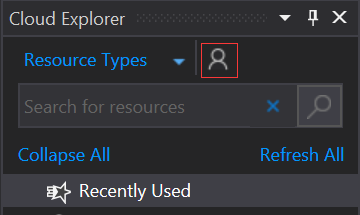
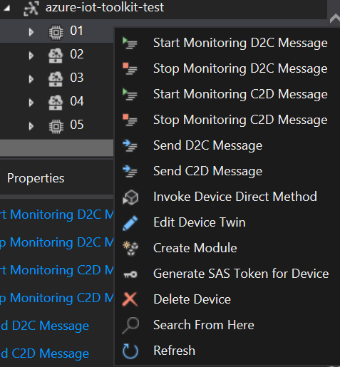

# Use Cloud Explorer for Visual Studio for Azure IoT Hub device management

[Cloud Explorer](https://marketplace.visualstudio.com/items?itemName=ms-azuretools.CloudExplorerForVS) is a useful Visual Studio extension that enables you to view your Azure resources, inspect their properties and perform key developer actions from within Visual Studio. It comes with management options that you can use to perform various tasks.

[!INCLUDE [iot-hub-basic](../../includes/iot-hub-basic-whole.md)]

| Management option          | Task                    |
|----------------------------|--------------------------------|
| Direct methods             | Make a device act such as starting or stopping sending messages or rebooting the device.                                        |
| Read device twin           | Get the reported state of a device. For example, the device reports the LED is blinking now.                                    |
| Update device twin         | Put a device into certain states, such as setting an LED to green or setting the telemetry send interval to 30 minutes.         |
| Cloud-to-device messages   | Send notifications to a device. For example, "It is very likely to rain today. Don't forget to bring an umbrella."              |

For more detailed explanation on the differences and guidance on using these options, see [Device-to-cloud communication guidance](iot-hub-devguide-d2c-guidance.md) and [Cloud-to-device communication guidance](iot-hub-devguide-c2d-guidance.md).

Device twins are JSON documents that store device state information (metadata, configurations, and conditions). IoT Hub persists a device twin for each device that connects to it. For more information about device twins, see [Get started with device twins](iot-hub-node-node-twin-getstarted.md).

## What you learn

You learn using Cloud Explorer for Visual Studio with various management options on your development machine.

## What you do

Run Cloud Explorer for Visual Studio with various management options.

## What you need

- An active Azure subscription.
- An Azure IoT Hub under your subscription.
- Microsoft Visual Studio 2017 Update 9 or later
- Cloud Explorer component from Visual Studio Installer (selected by default with Azure Workload)

## Update Cloud Explorer to latest version

The Cloud Explorer component from Visual Studio Installer only supports monitoring device-to-cloud and cloud-to-device messages. You need to download and install the latest [Cloud Explorer](https://marketplace.visualstudio.com/items?itemName=ms-azuretools.CloudExplorerForVS) to access the management options.

## Sign in to access your IoT Hub

1. In Visual Studio **Cloud Explorer** window, click the Account Management icon. You can open the Cloud Explorer window from **View** > **Cloud Explorer** menu.

    
1. Click **Manage Accounts** in Cloud Explorer.
1. Click **Add an account...** in the new window to sign in to Azure for the first time.
1. After you sign in, your Azure subscription list will be shown. Select the Azure subscriptions you want to view and click **Apply**.
1. Expand **Your subscription** > **IoT Hubs** > **Your IoT Hub**, the device list will be shown under your IoT Hub node. Right-click one device to access the management options.

    

## Direct methods

1. Right-click your device and select **Invoke Device Direct Method**.
1. Enter the method name and payload in input box.
1. Results will be shown in the **IoT Hub** output pane.

## Read device twin

1. Right-click your device and select **Edit Device Twin**.
1. An **azure-iot-device-twin.json** file will be opened with the content of device twin.

## Update device twin

1. Make some edits of **tags** or **properties.desired** field to the **azure-iot-device-twin.json** file.
1. Press **Ctrl+S** to update the device twin.
1. Results will be shown in the **IoT Hub** output pane.

## Send cloud-to-device messages

To send a message from your IoT Hub to your device, follow these steps:

1. Right-click your device and select **Send C2D Message**.
1. Enter the message in input box.
1. Results will be shown in the **IoT Hub** output pane.

## Next steps

You've learned how to use Cloud Explorer for Visual Studio with various management options.

[!INCLUDE [iot-hub-get-started-next-steps](../../includes/iot-hub-get-started-next-steps.md)]